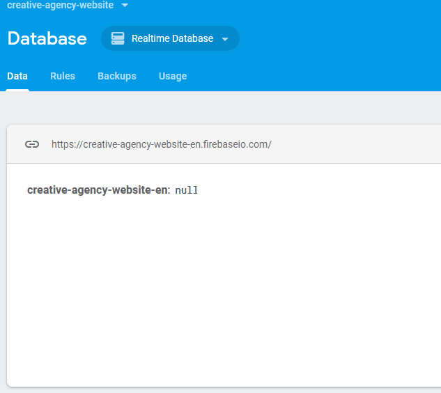

# Creative Agency Website
## Introduction
Website of fictitious company (Creative Agency) created by HTML5, CSS3 (Sass CSS preprocessor with SCSS syntax) and JavaScript (connection to Firebase database and scroll handling). 

## Setup
First install the dependencies (node_modules folder) using following command:
```shell
npm i node-sass
```
Use it only once in the project main directory. Then run Sass to CSS compiler using command:
```shell
npm run sass
```
Use it every time when you are changing main.scss file.

## Test of Firebase database


## Live demo
https://wieczorek-daniel.github.io/creative-agency-website/
